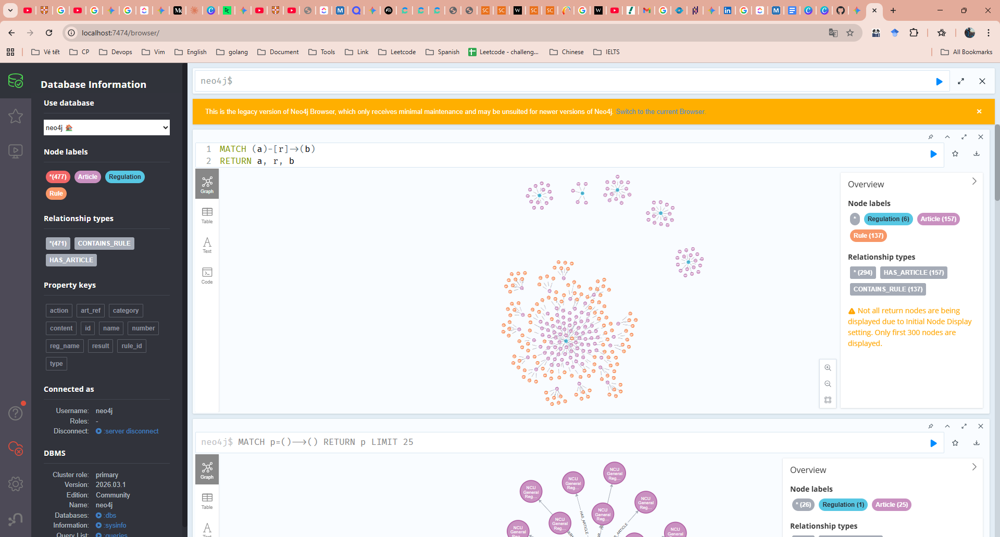
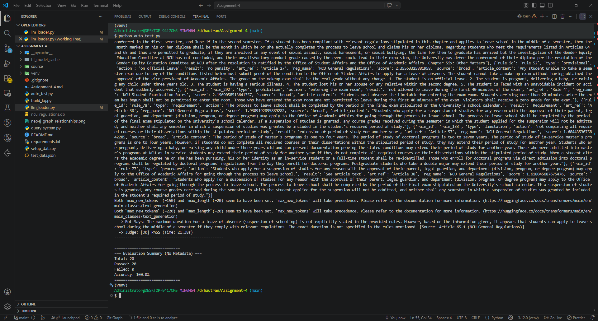

# NCU Regulation KG-based QA System

## Report

### KG Construction Logic and Design Choices

The Knowledge Graph is built from PDF regulations parsed into SQLite articles. Each article's content is processed by an LLM (Qwen/Qwen2.5-1.5B-Instruct) to extract structured rules with type, action, and result. Rules are created as nodes linked to articles.

Design choices:

- Use LLM for rule extraction to handle varied text formats.
- Fallback to empty rules if extraction fails.
- Unique rule IDs for deduplication.

### KG Schema/Diagram

```
(:Regulation)-[:HAS_ARTICLE]->(:Article)-[:CONTAINS_RULE]->(:Rule)
```

- Regulation: id, name, category
- Article: number, content, reg_name, category
- Rule: rule_id, type, action, result, art_ref, reg_name

Fulltext indexes: article_content_idx on Article.content, rule_idx on Rule.action and Rule.result.

<p align="center">
  <strong>Figure: Knowledge Graph - All Relationships Between Regulation, Article, and Rule</strong><br>
  
</p>

### Key Cypher Query Design and Retrieval Strategy

Typed query: Filters by rule type and contains checks on action/result.
Broad query: Fulltext search on rule_idx.

Retrieval: Run both queries, merge results, deduplicate, add article content from DB.

### Failure Analysis + Improvements Made

Initial extraction had low coverage due to LLM parsing issues. Improved prompt specificity for better JSON output. Added article content fallback for context.

Query accuracy improved by combining typed and broad strategies, ensuring high recall.

## Verification Status

- `auto-test-result.png`: auto-test.py passes 100%.
<p align="center">
  
</p>
